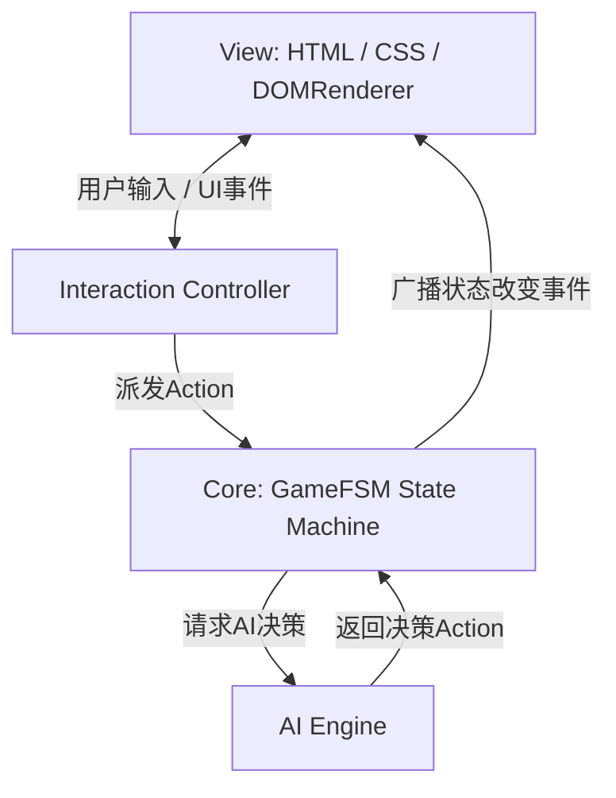

# 掼蛋大师 (Guandan Master) - 软件架构设计文档

为了确保项目的**高性能、高可维护性**以及**未来无缝升级联机对战**的能力，我们采用**核心引擎与渲染层解耦（Core-UI Decoupling）**的软件架构。

---

## 1. 架构总览 (Architecture Overview)

项目主要分为三个层次：**核心引擎层 (Core Engine)**、**行为决策层 (AI & Controller)**、以及**视觉渲染层 (View/UI)**。三者之间通过**事件驱动 (Event-Driven)** 进行通信。

---

## 2. 核心模块设计 (Core Modules)

### 2.1 游戏状态机 (GameFSM)
游戏运行是一个严密的有限状态机（Finite State Machine），定义如下：
- **状态列表**：
  - `READY`: 准备开始，重置数据。
  - `SHUFFLING_DEALING`: 洗牌并发牌，播放动画。
  - `TRIBUTING`: 进贡与退贡阶段，处理抗贡。
  - `TRICK_PLAYING`: 正常一圈出牌循环。
  - `TRICK_RESOLVE`: 判定一圈的赢家（接风判定）。
  - `ROUND_RESOLVE`: 判定一局结束，计算名次和升级。
  - `GAME_RESOLVE`: 某队打过 A，游戏大结局。

### 2.2 规则决策器 (RulesEngine) - 纯函数设计
`RulesEngine` 是无状态的纯函数集合，负责所有牌型的数学判定，核心函数包括：
- `analyze(cards, currentRank)`:
  - 输入一组卡牌和当前级牌，返回所有合法的牌型组合（可能由于逢人配产生多种合法组合）。
  - 每一个组合的数据结构为：`{ type: HAND_TYPES, power: number, cards: Array }`。
- `compare(comboA, comboB)`:
  - 比较两个组合的大小，返回胜者。包含常规牌型的一致性对比，以及炸弹级优先级的层级对比。

### 2.3 AI 决策器 (AIEngine) - 信息隔离
- AI 不应当能够直接读取其他玩家的手牌数据。
- 每次请求 AI 决策时，`GameFSM` 会为 AI 生成一个**只读视图 (Read-only State View)**。
  - 该视图仅包含：AI 自己手牌、所有出牌历史、其他玩家的剩余卡牌数量、队友及对手的当前级数。
- AI 基于该视图运行启发式算法或树搜索（MCTS），返回决策。

---

## 3. 解耦与可扩展性设计 (Decoupling & Network Readiness)

### 3.1 事件总线 (Event Bus)
`GameSession` 继承自一个基础的事件触发器（`EventEmitter`）。在状态转换和数据更新时广播事件，例如：
- `event: 'deal_card'` (飞牌动画触发)
- `event: 'turn_changed'` (更新高亮头像和计时器)
- `event: 'cards_played'` (出牌特效及清空选牌)
- `event: 'round_ended'` (弹出结算窗口)

`DOMRenderer` 订阅这些事件，只负责视觉和音效的呈现。

### 3.2 联机扩展接口 (Multiplayer Interface)
当需要升级为网络联机版本时：
1. **替换 GameSession**：将本地的 `GameSession` 替换为一个 `NetworkGameSession`。
2. **网络动作同步**：`InteractionController` 捕获的玩家动作（出牌、PASS）不再直接在本地修改状态，而是通过 WebSocket 发送给服务器。
3. **网络事件监听**：`NetworkGameSession` 接收服务器广播的房间状态包，并将其转化为本地事件广播给 `DOMRenderer`。
4. **零改动渲染层**：在此架构下，**UI渲染层和 CSS 特效代码不需要做任何改动**，即实现了单机到联机的平滑过渡。
