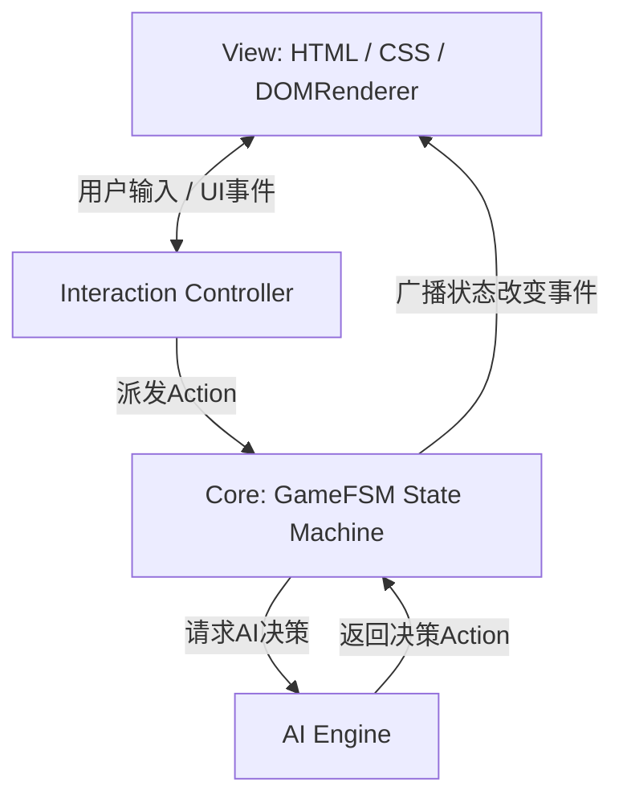

# 掼蛋大师 (Guandan Master) - 软件架构设计文档

为了确保项目的**高性能、高可维护性**以及**未来无缝升级联机对战**的能力，我们采用**核心引擎与渲染层解耦（Core-UI Decoupling）**的软件架构。

---

## 1. 架构总览 (Architecture Overview)

项目主要分为三个层次：**核心引擎层 (Core Engine)**、**行为决策层 (AI & Controller)**、以及**视觉渲染层 (View/UI)**。三者之间通过**事件驱动 (Event-Driven)** 进行通信。


```mermaid
graph TD
    A[View: HTML / CSS / DOMRenderer] <-->|用户输入 / UI事件| B[Interaction Controller]
    B -->|派发Action| C[Core: GameFSM State Machine]
    C -->|广播状态改变事件| A
    C -->|请求AI决策| D[AI Engine]
    D -->|返回决策Action| C
```

---

## 2. 核心模块设计 (Core Modules)

### 2.1 游戏状态机 (GameFSM)

游戏运行是一个严密的有限状态机（Finite State Machine），定义如下：

- **状态列表**：
  - `READY`: 准备开始，重置数据。
  - `SHUFFLING_DEALING`: 洗牌并发牌，播放动画。
  - `TRIBUTING`: 进贡与退贡阶段，处理抗贡。
  - `TRICK_PLAYING`: 正常一圈出牌循环。
  - `TRICK_RESOLVE`: 判定一圈的赢家（接风判定）。
  - `ROUND_RESOLVE`: 判定一局结束，计算名次和升级。
  - `GAME_RESOLVE`: 某队打过 A，游戏大结局。

### 2.2 规则决策器 (RulesEngine) - 纯函数设计

`RulesEngine` 是无状态的纯函数集合，负责所有牌型的数学判定，核心函数包括：

- `analyze(cards, currentRank)`:
  - 输入一组卡牌和当前级牌，返回所有合法的牌型组合（可能由于逢人配产生多种合法组合）。
  - 每一个组合的数据结构为：`{ type: HAND_TYPES, power: number, cards: Array }`。
- `compare(comboA, comboB)`:
  - 比较两个组合的大小，返回胜者。包含常规牌型的一致性对比，以及炸弹级优先级的层级对比。

### 2.3 AI 决策器 (AIEngine) - 信息隔离

- AI 不应当能够直接读取其他玩家的手牌数据。
- 每次请求 AI 决策时，`GameFSM` 会为 AI 生成一个**只读视图 (Read-only State View)**。
  - 该视图仅包含：AI 自己手牌、所有出牌历史、其他玩家的剩余卡牌数量、队友及对手的当前级数。
- AI 基于该视图运行启发式算法或树搜索（MCTS），返回决策。

---

## 3. 解耦与可扩展性设计 (Decoupling & Network Readiness)

### 3.1 事件总线 (Event Bus)

`GameSession` 继承自一个基础的事件触发器（`EventEmitter`）。在状态转换和数据更新时广播事件，例如：

- `event: 'deal_card'` (飞牌动画触发)
- `event: 'turn_changed'` (更新高亮头像和计时器)
- `event: 'cards_played'` (出牌特效及清空选牌)
- `event: 'round_ended'` (弹出结算窗口)

`DOMRenderer` 订阅这些事件，只负责视觉和音效的呈现。

### 3.2 联机扩展接口 (Multiplayer Interface)

当需要升级为网络联机版本时：

1. **替换 GameSession**：将本地的 `GameSession` 替换为一个 `NetworkGameSession`。
2. **网络动作同步**：`InteractionController` 捕获的玩家动作（出牌、PASS）不再直接在本地修改状态，而是通过 WebSocket 发送给服务器。
3. **网络事件监听**：`NetworkGameSession` 接收服务器广播的房间状态包，并将其转化为本地事件广播给 `DOMRenderer`。
4. **零改动渲染层**：在此架构下，**UI渲染层和 CSS 特效代码不需要做任何改动**，即实现了单机到联机的平滑过渡。

---

## 4. TensorFlow.js 深度学习 AI 架构与 SDD+TDD 规范

为了大幅提升 AI 的出牌上限，在 `feature/ai-scoring-optimization` 分支中集成了基于 **TensorFlow.js (TFJS)** 的深度强化学习推理引擎，参考 DouZero 与 OpenGuanDan (DanZero) 标杆架构。

### 4.1 两阶段决策范式 (Two-Stage Decision Flow)

```
┌────────────────────────────────────────────────────────┐
│  AI Decision Architecture                              │
│                                                        │
│  ┌──────────────────────────────────────────────────┐  │
│  │  Layer 1: 合法动作生成器 (TS Rule Engine)         │  │ （基于纯 TS 规则 ai_auditor.ts）
│  │  根据当前局面提取所有合法的 Candidate Actions       │  │
│  └──────────────────────┬───────────────────────────┘  │
│                         ↓                              │
│  ┌──────────────────────────────────────────────────┐  │
│  │  Layer 2: TFJS 神经网络 Q 值评估引擎              │  │
│  │  输入 540 维 State Vector 评估每个候选动作得分   │  │
│  └──────────────────────┬───────────────────────────┘  │
│                         ↓                              │
│  ┌──────────────────────────────────────────────────┐  │
│  │  Layer 3: 三级 Fallback 降级防护网               │  │
│  │  Tier 1(大模型) → Tier 2(内置MLP) → Tier 3(启发式) │  │
│  └──────────────────────────────────────────────────┘  │
└────────────────────────────────────────────────────────┘
```

### 4.2 540 维 State Vector 特征向量 Schema 规范

为了将非完全信息的掼蛋局势转化给神经网络计算，建立以下定长特征张量：

- **玩家手牌特征分块 (108维)**：54 张不同扑克（含红/黑大王及硬主）的二元或张数独热/标量编码。
- **压牌与出牌历史分块 (162维)**：上家打出的组合特征 + 队友/敌方历史出牌统计 (3 × 54维)。
- **级牌与游戏上下文 (36维)**：当前局打几、红桃逢人配位置、剩余手牌数与过 A 状态特征。
- **全量定长输入 Tensor Shape**：`[batch_size, 540]`。

### 4.3 SDD + TDD 混合开发规范 (Hybrid Methodology)

1. **SDD 规范先行 (Specification-First)**：先定义 `tfjs_encoder.ts` 特征张量 Schema 和 `TFJSGuandanAgent` 接口契约。
2. **TDD 测试驱动 (Red Stage)**：在 `tests/tfjs.test.ts` 中编写测试，断言 Tensor Shape `[1, 540]`、张量数值边界与 3 级 Fallback 降级。
3. **实现与绿灯 (Green Stage)**：实现业务逻辑并达到全量测试 100% 通过。
4. **重构与防泄漏 (Refactor Stage)**：使用 `tf.tidy()` 释放显存/内存，防止 GPU 泄漏。
