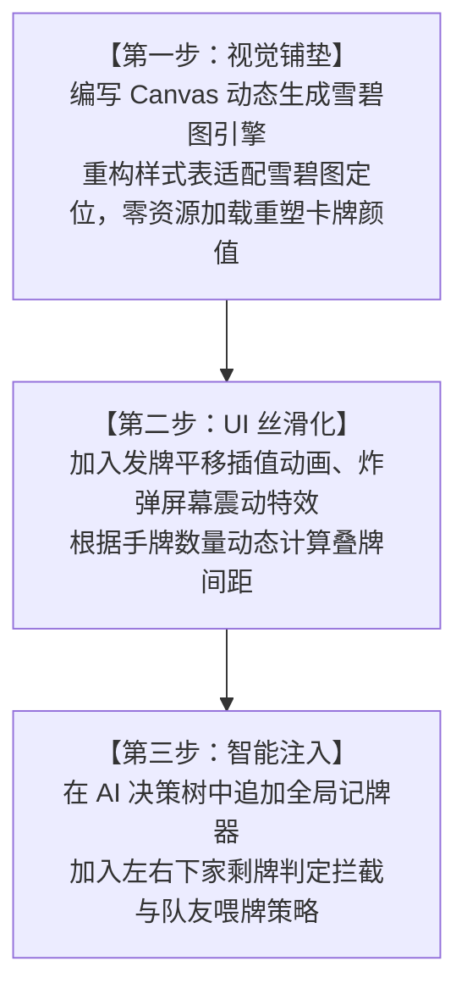

# 掼蛋开源实现与技术评估报告

本报告聚焦于**掼蛋智能 AI 实现**、**卡牌本地渲染**以及**游戏 UI/动效提升**三大核心方向。通过深度解析 GitHub、Gitee 上的热门开源项目（如 `OpenGuanDan`、`GuanDanInOffice`、`eggbomb` 等），为本项目后续的迭代升级提供详尽的技术评估与方案选择，不触动现有项目源码。

---

## 一、 掼蛋智能 AI 本地算法评估

掼蛋作为四人非完全信息博弈游戏，其 AI 设计的难点在于：**手牌组合穷举空间大**、**逢人配（主牌红桃）的万能替代**以及**强烈的队友合作对抗属性**。

开源项目中主要存在以下三种智能实现方式：

### 1. 启发式规则树与状态判定（基于 Heuristics 规则，推荐本地首选）
*   **代表仓库**：`LiUshin/GuanDanInOffice`、`dengweiqh/guandan-windows`
*   **技术框架**：纯代码逻辑（TypeScript / Python / C#），基于决策树的条件分支判断。
*   **核心逻辑拆解**：
    1.  **手牌预拆分 (Hand Parsing)**：在发牌完毕后，算法首先将手牌整理为：单张、对子、三带二、三顺（钢板）、单顺、双顺、炸弹等组合的集合，并计算出完这些组合所需的最小“手路数”（出牌次数）。
    2.  **队友配合机制 (Teammate Synergy)**：
        - 每次跟牌时，判断当前出大牌的赢家是不是队友。若是队友，则 AI 倾向于选择 `PASS` 或垫一张最小的无用牌，以保护队友的牌权。
        - “接风”判断：若队友打完最后一张牌，AI 优先打出队友可能喜欢的牌型。
    3.  **防守与阻击 (Defense & Bombing)**：
        - 实时监控左右两个对手的剩余卡牌数量。
        - **防守阈值**：当对手手牌少于等于 5 张时，AI 触发“绝杀拦截”状态，跟牌时如果无法小压，将立刻打出炸弹拦截，防止对手轻松跑单。
    4.  **局内记牌器 (Card Tracker)**：记录打出的所有王牌（4张大王、4张小王）和级牌（8张）。当大牌出尽时，AI 能够推算出自己手上的大牌（如主牌 A）是否拥有绝对控制权（俗称“封顶”），从而做出激进冲牌决策。
*   **本地落地评估**：最适合本项目的方案。执行速度极快（<1ms），零第三方依赖，可直接在 `src/ai.ts` 中通过优化规则树和引入记牌器来实现，内存占用极小。

### 2. 蒙特卡洛树搜索（MCTS / IS-MCTS）
*   **代表仓库**：部分通用扑克博弈项目。
*   **技术框架**：非完全信息蒙特卡洛树搜索。
*   **核心逻辑拆解**：
    - 由于看不到别人的手牌，AI 每次决策时，先根据场上已知出过的牌和自己手牌，对剩下的卡牌进行随机洗牌并分配给其他三名玩家（称为 **世界坍缩/Determinization**）。
    - 在这个确定的模拟世界中进行数万次快速自我对局模拟，统计各个出牌动作的最终胜率，取最优解。
*   **本地落地评估**：复杂度高，纯 JavaScript/TypeScript 在浏览器单线程中执行数万次模拟会导致短暂的 UI 卡顿，需使用 Web Workers 在后台进行多线程推演，适合后续进阶开发。

### 3. 深度学习与强化学习模型（基于 Neural Network，顶级智能）
*   **代表仓库**：`GameAI-NJUPT/OpenGuanDan`（集成 DanZero、GuanZero）
*   **技术框架**：**PyTorch (训练) -> ONNX (部署) -> ONNX Runtime Web (本地推理)**
*   **核心逻辑拆解**：
    - **状态编码 (State Encoding)**：将当前的局级、手牌、出牌历史、每个人剩余张数转化为一维张量（特征矩阵）。
    - **神经网络推理**：通过全连接层与循环神经网络（RNN）预测每一个出牌动作的期望收益值（Value）。
    - **本地部署**：将训练好的 `.onnx` 模型放入项目 `assets/` 下，在浏览器端引用 `onnxruntime-web.js`。每次轮到 AI 出牌时，向模型注入当前对局的状态向量，调用 GPU/WASM 进行推理，得出毫秒级的出牌方案。
*   **本地落地评估**：智能化程度极高（具备职业牌手水准），但模型文件体积较大（一般在 10MB~50MB 之间），且需要前期大量的离线强化学习训练支持，适合项目作为“究极智能”的研究选型。

---

## 二、 卡牌本地渲染与贴图重构评估

为了提升卡牌界面的精美度，摆脱目前使用 CSS 拼接 Unicode 字符（♥/♦/♣/♠）的“简易感”，开源项目通常采用以下三种图像渲染模式：

### 1. 静态雪碧图定位 (Static Sprite Sheet + CSS Offset，最推荐)
*   **代表仓库**：`jiaguo1000/eggbomb`、各类网页棋牌游戏。
*   **实现机制**：
    - 预先准备一张 `cards_sprite.png`，内含 13 列 × 5 行的卡牌矩阵。
    - **性能优势**：整个游戏只需发起 **1次** 图片网络请求。浏览器将整张雪碧图加载到 GPU 显存后，每次绘制卡牌，GPU 仅需通过纹理坐标（Texture Coordinates）改变渲染切片，效率极高，避免了卡牌滑动时的瞬间闪烁。
    - **CSS 核心定位公式**：
      ```css
      .card-face {
        background-image: url('cards_sprite.png');
        background-size: 1300% 500%; /* 13列 5行 */
        background-position: calc(var(--col) * (100% / 12)) calc(var(--row) * (100% / 4));
      }
      ```

### 2. 客户端 Canvas 动态合成雪碧图 (Dynamic Canvas Generator，零请求方案)
*   **技术框架**：HTML5 Canvas 2D Context。
*   **实现机制**：
    - 游戏启动时，利用一个绘制脚本在内存中的 Canvas 上绘制 54 张卡牌（使用代码绘制精美角标、金色皇冠底纹、渐变牌背），然后执行 `canvas.toDataURL()` 生成一张动态 Base64 雪碧图，动态写入 CSS 变量。
    - **优势**：**零网络图片请求**，完全代码生成，分辨率独立，能够非常容易地支持高分辨率的卡牌缩放，且可以非常简单地通过代码改变卡牌的主题（例如一键切换“国风主题”或“护眼绿主题”）。

### 3. 独立 SVG 矢量图资源加载 (Individual Vector SVGs)
*   **实现机制**：
    - 每一个卡牌对应一个独立的 `.svg` 矢量文件，例如 `H10.svg`、`back.svg`。
    - **优势**：SVG 是矢量格式，无论放大到什么尺寸（甚至是视网膜屏幕）都极其清晰锐利。
    - **劣势**：游戏首次加载时需要连续发起 55 次网络请求（54张牌 + 1张牌背），在弱网环境下会导致卡牌逐个显现，影响首局体验。

---

## 三、 UI 与动效细节提升方案评估

为了营造“尊贵毛玻璃”、“丝滑交互”的现代游戏感，开源项目的视觉提升主要体现在以下方面：

### 1. 发牌飞行动效 (Card Dealing Animation)
*   **实现方式**：
    - 当 `session` 触发 `deal_started` 时，不应该瞬间把手牌塞入玩家容器，而是从牌桌中心（发牌点）创建临时飞行卡牌 `.card.flying`。
    - 利用 CSS `transition` 或 JS `requestAnimationFrame`，计算发牌中心到四方玩家座位的 X/Y 坐标差，以 `cubic-bezier(0.25, 1, 0.5, 1)`（缓出）速度飞向座位，并在抵达后销毁飞行卡牌、让座位手牌数角标累加。这会带来真实的物理开牌感。

### 2. 出牌区与操作面板自适应 (Responsive Play Zones)
*   **实现方式**：
    - 在 1000px 左右的小屏幕上，27 张卡牌如果不重叠会超出屏幕。
    - **负边距重叠**：使用 CSS flex 布局，对 `.card` 设置 `margin-right: -42px;`，让手牌叠放。当鼠标 hover 到某张牌上时，利用 `transform: translateY(-24px) scale(1.05);` 配合 `z-index: 100 !important;` 让选中的牌凸显。
    - **自适应重叠度**：在 TS 代码中，根据当前玩家手牌的张数（27张到1张）动态计算并修改 CSS 变量 `--card-gap`，牌多时叠得紧，牌少时拉得开。

### 3. 特殊牌型炸弹特效 (Bomb VFX & Screen Shake)
*   **实现方式**：
    - 当检测到出牌牌型为 `BOMB` 时，触发游戏桌面的爆裂震动。
    - **震动特效**：给游戏主桌 `game-table` 临时追加 `.screen-shake` 类，通过 CSS 帧动画 (`@keyframes shake`) 在 400ms 内对桌子做微小的随机位移偏移。
    - **粒子系统**：在出牌区中心动态生成 20-30 个彩色的 `.particle` DOM 节点，朝四周随机方向放射飞成并淡出，极大强化打出炸弹时的爽快感。

---

## 四、 总结与推荐技术路线

若要启动本项目的智能、UI 升级，推荐采用以下分步演进的技术路线：



本评估报告已记录在项目文档中，不涉及任何现有业务代码的改动，供后续阶段讨论及方案审阅。
